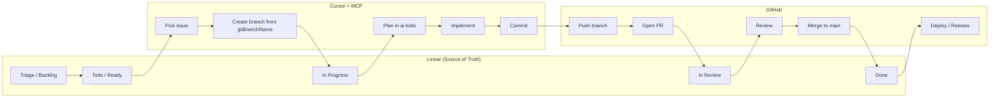

# Linear Integration Design

**Tasks:** #266.2 (Best practices) + #266.3 (Implementation plan for REVIEW)
**Date:** 2026-01-28
**Context:** Headless workflow — Linear drives work; GitHub/Cursor execute it.
**Prerequisite:** [docs/linear_integration_assessment.md](linear_integration_assessment.md) (current capabilities and MCP payloads).

---

## 1. Data Model: Linear ↔ GitHub

Explicit mapping between Linear entities and GitHub (and Cursor) so automation and conventions are unambiguous.

### 1.1 Recommendation: 1 Team = 1 Repo

| Linear | GitHub | Notes |
|--------|--------|--------|
| **Workspace** (e.g. fxstein) | Organization or account (e.g. fxstein) | One workspace can contain multiple teams; each team maps to one repo. |
| **Team** | **Repository** | **1 Team = 1 Repo.** Team key becomes the issue prefix (e.g. team "ai-todo" → key **AIT** → identifiers AIT-1, AIT-2). |
| **Project** | **Milestone** (optional) | Linear Projects group issues; GitHub Milestones group issues/PRs. Map by name or convention (e.g. "Q1 2026" ↔ milestone "Q1 2026"). Not required for headless flow. |
| **Cycle** | **Release / tag** (optional) | Linear Cycles are time-boxed. Map to GitHub Releases or tags (e.g. cycle "Sprint 3" → release `v3.0.0-beta.3`). Assessment: cycle not in issue payload; use list_cycles(teamId) or filter list_issues(cycle=...) if needed. |
| **Issue** | **Branch + PR** | One Linear issue → one branch (name includes identifier) → one PR. Merge closes the loop. |
| **Issue state** (e.g. In Progress, In Review, Done) | **Branch existence + PR state** | Linear state can be updated from Cursor (update_issue) or from GitHub Actions (e.g. on PR open → "In Review"; on merge → "Done"). |

### 1.2 Current Mapping (ai-todo)

| Linear | GitHub |
|--------|--------|
| Workspace: fxstein | Org/account: fxstein |
| Team: **ai-todo** (id: `6e5ad3a4-ca85-4717-a40b-425d361e5191`) | Repo: **fxstein/ai-todo** |
| Issue identifier: **AIT-**&lt;number&gt; (e.g. AIT-1, AIT-266) | Branch: `user/AIT-&lt;n&gt;-short-desc`; PR title includes `AIT-&lt;n&gt;` |
| (Projects / Cycles) | (Milestones / tags `v*` — existing CI/CD) |

### 1.3 Out of Scope for This Design

- **Multiple repos per team:** We assume 1 team = 1 repo. Cross-repo or monorepo layout would extend this model.
- **Assignee in payload:** Assessment shows assignee is not in the issue response; we filter by `assignee: "me"` when listing. No automation that "reads" assignee from get_issue.
- **Cycle in payload:** Cycle is not in the issue object; we do not rely on it for branch/PR automation in this phase.

---

## 2. Branching Strategy

Branch names must guarantee **Linear auto-linking** (Linear’s GitHub integration links branches/PRs/commits that contain the issue identifier).

### 2.1 Required Format

```text
<user>/<IDENTIFIER>-<short-slug>
```

- **&lt;user&gt;:** GitHub/Linear display name or username (lowercase, no spaces). Example: `fxstein`.
- **&lt;IDENTIFIER&gt;:** Full Linear issue identifier (team key + number). For ai-todo: **AIT-&lt;n&gt;** (e.g. `AIT-12`, `AIT-266`). Must match exactly so Linear can link.
- **&lt;short-slug&gt;:** Short kebab-case description (optional but recommended). Example: `add-login`, `fix-checksum`.

**Examples (ai-todo):**

- `fxstein/AIT-12-add-login`
- `fxstein/AIT-266-linear-integration`
- `fxstein/AIT-1-test-issue` (matches Linear’s `gitBranchName` format from assessment)

### 2.2 Rules

1. **Identifier is mandatory.** Without it, Linear cannot auto-link the branch/PR to the issue.
2. **Use Linear’s `gitBranchName` when available.** MCP `get_issue` / `list_issues` return `gitBranchName` (e.g. `fxstein/ait-1-test-issue`). Prefer that for new branches so naming stays in sync.
3. **If creating a branch manually:** Use the format above. Cursor rules will remind (or correct) if the branch doesn’t match.
4. **No spaces; use hyphens.** Branch names must be valid git refs.

### 2.3 What Linear Expects (for auto-linking)

- Branch name **contains** the issue identifier (e.g. `AIT-12`).
- PR title or body can also contain the identifier for linking.
- Commits with identifier in message can link as well.

Our convention ensures the **branch** always carries the identifier, so the PR (created from that branch) auto-links without extra steps.

---

## 3. Life of a Ticket — Workflow (Mermaid)

End-to-end flow from Linear triage to merge/deploy. All steps are designed for a **headless** flow: Linear is the source of truth; Cursor and GitHub execute.



### 3.1 Step-by-Step (Narrative)

| Step | Actor | Action | Linear state (after) |
|------|--------|--------|----------------------|
| 1 | Human / triage | Issue created or moved to Todo (or assignee set). | Backlog → Todo |
| 2 | Cursor (agent) | User says “Start work” / “Kickoff”. Agent calls `list_issues(assignee: "me")`, user picks issue (e.g. AIT-266). | — |
| 3 | Cursor | Agent calls `get_issue(id)` for chosen issue; reads `gitBranchName` (e.g. `fxstein/ait-266-linear-integration`). Creates branch with that name (or enforces format). | Optional: update_issue(state: "In Progress") |
| 4 | Cursor | Agent creates ai-todo task + subtasks from issue description; confirms plan with user. | — |
| 5 | Cursor | Implement, commit (message can include `AIT-266` for linking). | — |
| 6 | Cursor / Human | Push branch to GitHub. | — |
| 7 | Human / Cursor | Open PR (from branch that already contains AIT-266). Linear auto-links PR to issue. | Optional: update_issue(state: "In Review") |
| 8 | Human | Review, approve. | — |
| 9 | Human / Cursor | Merge PR to `main`. | Optional: update_issue(state: "Done") |
| 10 | GitHub Actions | Existing CI/CD runs (tests, release on tag). | — |

“Optional” Linear state updates can be done by the agent (Cursor rule) or by a GitHub Action (with Linear API key). This design specifies both options in the automation section below.

---

## 4. Automation Specification

Concrete artifacts we will add or change to enforce the above: Cursor rules (`.mdc`) and GitHub Actions.

### 4.1 Cursor Rules (.mdc)

| File | Purpose |
|------|--------|
| **`.cursor/rules/linear-ai-todo-integration.mdc`** (update) | Fix API usage and encode headless workflow: `get_user("me")`, `list_issues(assignee: "me")`, `get_issue(id)`, `update_issue(id, state: …)` (e.g. "In Review" or "Done"). Add: when starting work, create branch from `gitBranchName` (or enforce `<user>/<IDENTIFIER>-<slug>`). |
| **`.cursor/rules/linear-branch-naming.mdc`** (new) | **Branch naming enforcement.** When the user or agent creates a branch for a Linear issue: (1) Prefer `gitBranchName` from `get_issue` / `list_issues`. (2) If creating without an issue: require format `user/IDENTIFIER-short-desc` and remind to pick an issue first. (3) **If current branch does not match** `*/AIT-<n>-*` (or team key + number): suggest renaming to the correct format and show the command (e.g. `git branch -m <new-name>`). No automatic rename without user confirmation. |
| **`.cursor/rules/commit-standards.mdc`** (optional tweak) | Suggest including Linear identifier in commit message (e.g. `feat: Add login (AIT-12)`) when branch name contains AIT-* so commits auto-link. |

**Behavior summary**

- **Kickoff:** Linear integration rule drives “Start work” → list my issues → get issue → create branch from `gitBranchName` → create ai-todo plan.
- **Branch naming:** New rule ensures we use `gitBranchName` when available; if branch exists but doesn’t match pattern, suggest rename and show command (no auto-rename without confirmation).
- **Closing:** Linear rule: when ai-todo tasks done, ask to move issue to “In Review”; on PR merge (or when user says “PR merged”), suggest `update_issue(id, state: "Done")`.

### 4.2 GitHub Actions

| Workflow / Job | Purpose |
|----------------|--------|
| **PR check: Branch and title (new job or new workflow)** | On `pull_request` to `main`: (1) Check that branch name matches `*/AIT-<number>-*` (regex). (2) Optionally check PR title contains `AIT-<number>`. On failure: comment on PR with the required format and link to this design doc. No block required initially; can be made required later. |
| **PR comment: Linear link (optional)** | On `pull_request`: Parse branch name for identifier (e.g. `AIT-12`); comment on PR with “Linear: https://linear.app/fxstein/issue/AIT-12/...” so reviewers have one-click link. |
| **On merge: Update Linear (optional, needs secret)** | On push to `main` (merge): Parse commit or PR for identifier (e.g. from branch name or PR title). Call Linear API to set issue state to “Done”. Requires `LINEAR_API_KEY` (or similar) in repo secrets. Document in Day 1 / ops doc. |

**Implementation order**

1. **Cursor rules:** Update linear-ai-todo-integration.mdc; add linear-branch-naming.mdc; optionally extend commit-standards.mdc.
2. **GitHub:** Add PR check (branch name + optional title); add optional PR comment with Linear link.
3. **Later:** Add “on merge → Linear Done” job once secret and API choice are approved.

### 4.3 What We Do Not Automate (By Design)

- **Auto-rename branch without confirmation:** The Cursor rule only suggests rename and shows the command; user or agent must run it.
- **Creating branches without a Linear issue:** We require picking an issue first so `gitBranchName` or identifier is always known.
- **Assignee/cycle in payload:** We do not depend on assignee or cycle in the issue object for this automation (see assessment).

---

## 5. Summary

| Area | Decision |
|------|----------|
| **Data model** | 1 Team = 1 Repo. ai-todo team → fxstein/ai-todo. Issue = branch + PR. |
| **Branch format** | `user/IDENTIFIER-short-desc` (e.g. `fxstein/AIT-12-add-login`). Use Linear `gitBranchName` when available. |
| **Life of a ticket** | Linear (Triage → Todo) → Cursor (pick issue, branch from gitBranchName, ai-todo plan, implement, push) → GitHub (PR → review → merge) → Deploy. |
| **Cursor** | Fix and extend linear-ai-todo-integration.mdc; add linear-branch-naming.mdc (suggest rename if branch doesn’t match; no auto-rename without confirmation). |
| **GitHub** | PR check (branch name + optional title); optional PR comment with Linear link; optional on-merge Linear state update (with secret). |

---

**STOP for human review.** After approval, proceed to implementation (#266.4) and then test & docs (#266.5).

*Design doc for tasks #266.2 and #266.3. Prerequisite: [linear_integration_assessment.md](linear_integration_assessment.md).*
